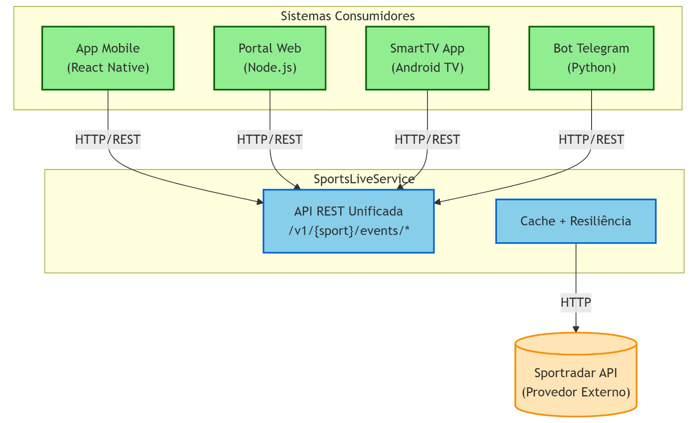

# SportsLiveService - Apresentação

## Trabalho de Reuso de Software

---

# Sumário

1. [Demonstração do Microserviço](#1-demonstração-do-microserviço)
2. [Justificativa das Escolhas Arquiteturais](#2-justificativa-das-escolhas-arquiteturais)
3. [Demonstração de Reuso em Outro Sistema](#3-demonstração-de-reuso-em-outro-sistema)

---

# 1. Demonstração do Microserviço

## Visão Geral

O **SportsLiveService** é um **microserviço** para consumo de dados esportivos em tempo real. O serviço fornece uma **API unificada** para acessar informações de múltiplos esportes através de uma única interface, consumindo dados da Sportradar API.

## Esportes Suportados

| Esporte               | Status          | Descrição                                      |
| --------------------- | --------------- | ---------------------------------------------- |
| Soccer (Futebol)      | ✅ Implementado | Dados completos de partidas, placar e timeline |
| Basketball (Basquete) | ✅ Implementado | Estatísticas, play-by-play e scores            |
| Tennis (Tênis)        | ✅ Implementado | Informações de sets, games e pontos            |

## Endpoints da API

A API segue o padrão REST com versionamento e documentação OpenAPI/Swagger:

```
Base URL: /v1/{sport}/events
```

| Endpoint                                 | Descrição                        |
| ---------------------------------------- | -------------------------------- |
| `GET /{sport}/events/{eventId}`          | Detalhes completos do evento     |
| `GET /{sport}/events/{eventId}/score`    | Placar atual em tempo real       |
| `GET /{sport}/events/{eventId}/timeline` | Timeline/play-by-play            |
| `GET /{sport}/events/{eventId}/stats`    | Estatísticas básicas e avançadas |
| `GET /{sport}/events/live`               | Lista de eventos ao vivo         |
| `GET /{sport}/events/scheduled`          | Eventos agendados para hoje      |

## Exemplo de Uso

```bash
# Obter placar de uma partida de futebol
GET /v1/soccer/events/12345/score

# Resposta
{
  "eventId": "12345",
  "homeScore": 2,
  "awayScore": 1,
  "period": "2nd_half",
  "clock": "78:32"
}
```

## Swagger UI

Documentação interativa disponível em: `/swagger-ui.html`

---

# 2. Justificativa das Escolhas Arquiteturais

## Arquitetura em Camadas


**Descrição das Camadas:**

| Camada             | Responsabilidade                                                       |
| ------------------ | ---------------------------------------------------------------------- |
| **API Layer**      | Recebe requisições HTTP e expõe endpoints REST                         |
| **Service Layer**  | Orquestra a lógica de negócio, gerencia cache e roteia para adapters   |
| **Adapter Layer**  | Converte dados específicos de cada esporte para modelo unificado       |
| **Infrastructure** | Comunicação com APIs externas com resiliência (retry, circuit breaker) |

## Padrões de Projeto Utilizados

### 1. **Strategy Pattern** (Padrão Estratégia)

**O que é:** Padrão que permite definir algoritmos intercambiáveis em classes separadas, escolhendo qual usar em tempo de execução.

**Aplicação:** Interface `SportAdapter` define o contrato comum. Cada esporte (Soccer, Basketball, Tennis) implementa sua própria estratégia de obtenção e conversão de dados.

```java
public interface SportAdapter {
    Sport getSupportedSport();
    SportEvent getEvent(String eventId);
    Score getScore(String eventId);
    Timeline getTimeline(String eventId);
    Statistics getStatistics(String eventId, StatisticsFilter filter);
    List<SportEvent> listLiveEvents();
    List<SportEvent> listScheduledEvents();
}
```

**Benefício:** Permite adicionar novos esportes sem modificar código existente (Princípio Aberto-Fechado).

---

### 2. **Adapter Pattern** (Padrão Adaptador)

**O que é:** "Tradutor" que converte interfaces incompatíveis para trabalharem juntas.

**Aplicação:** A API externa (Sportradar) retorna dados em formatos diferentes para cada esporte. Cada adapter converte esses dados para nosso modelo unificado (`SportEvent`, `Score`, `Timeline`).

```java
@Component
public class SoccerAdapter implements SportAdapter {
    private final SportradarClient client;

    @Override
    public SportEvent getEvent(String eventId) {
        Map<String, Object> response = client.getSoccerMatch(eventId);
        return mapToSportEvent(response);
    }
}
```

**Benefício:** Isola mudanças da API externa - se Sportradar mudar, apenas o adapter precisa ser alterado.

---

### 3. **Dependency Injection** (Injeção de Dependência)

**O que é:** Técnica onde as dependências são fornecidas externamente pelo container Spring, ao invés de serem criadas internamente.

**Aplicação:** O Spring injeta automaticamente um Map com todos os adapters registrados, permitindo descoberta dinâmica de novos esportes.

```java
@Service
public class EventService {
    private final Map<String, SportAdapter> adapters;

    public EventService(@Qualifier("sportAdapters") Map<String, SportAdapter> adapters) {
        this.adapters = adapters;
    }

    private SportAdapter getAdapter(String sport) {
        return adapters.get(sport.toLowerCase());
    }
}
```

**Benefício:** Basta criar uma nova classe com `@Component` para registrar um novo esporte automaticamente.

## Padrões de Resiliência

| Padrão              | O que faz                                                                   |
| ------------------- | --------------------------------------------------------------------------- |
| **Circuit Breaker** | "Abre o circuito" quando há muitas falhas, evitando chamadas desnecessárias |
| **Retry**           | Repete a requisição automaticamente em caso de falha temporária             |
| **Timeout**         | Define tempo máximo de espera para evitar bloqueio indefinido               |

### Circuit Breaker + Retry + Timeout

```java
@CircuitBreaker(name = "sportradar", fallbackMethod = "fallbackMap")
@Retry(name = "sportradar")
@TimeLimiter(name = "sportradar")
public Map<String, Object> getSoccerMatch(String matchId) {
    // Chamada à API externa
}
```

**Configuração:**
| Padrão | Valor |
|--------|-------|
| Circuit Breaker | 50% failure threshold |
| Retry | 3 tentativas com backoff exponencial |
| Timeout | 10 segundos |

**Benefícios:**

- ✅ Protege contra falhas em cascata
- ✅ Recuperação automática de falhas temporárias
- ✅ Evita sobrecarga de serviços degradados

## Cache com Caffeine

```java
@Cacheable(value = "live-scores", key = "#sport + '-' + #eventId")
public Score getScore(String sport, String eventId) {
    return getAdapter(sport).getScore(eventId);
}
```

**Benefícios:**

- ✅ Reduz chamadas à API externa
- ✅ Melhora tempo de resposta
- ✅ Controle granular por tipo de dado

## Stack Tecnológica

| Tecnologia        | Versão | Finalidade             |
| ----------------- | ------ | ---------------------- |
| Spring Boot       | 3.2.0  | Framework base         |
| Spring WebFlux    | -      | Cliente HTTP reativo   |
| Resilience4j      | 2.1.0  | Padrões de resiliência |
| Caffeine          | -      | Cache em memória       |
| SpringDoc OpenAPI | 2.3.0  | Documentação Swagger   |

---

# 3. Demonstração de Reuso em Outro Sistema

O **SportsLiveService** pode ser consumido por qualquer sistema que precise de dados esportivos em tempo real. Abaixo estão exemplos práticos de reuso.

---

## Arquitetura de Reuso



---

## Sistema 1: Aplicativo Mobile de Placar

Um app mobile que mostra placares ao vivo reutilizando o microserviço.

**Consumo da API (React Native / Flutter):**

```javascript
const API_URL = "https://sportslive-service.koyeb.app";

async function getJogosAoVivo() {
  const response = await fetch(`${API_URL}/v1/soccer/events/live`);
  const jogos = await response.json();

  return jogos.map((jogo) => ({
    casa: jogo.homeTeam.name,
    visitante: jogo.awayTeam.name,
    placar: `${jogo.homeScore} x ${jogo.awayScore}`,
    tempo: jogo.clock,
  }));
}

const jogos = await getJogosAoVivo();
jogos.forEach((j) => console.log(`${j.casa} ${j.placar} ${j.visitante}`));
```

**Resultado no App:**

```
Flamengo 2 x 1 Palmeiras (72')
Real Madrid 0 x 0 Barcelona (45')
```

---

## Sistema 2: Portal de Notícias Esportivas

Um site de notícias que exibe estatísticas de jogos.

**Consumo via Backend (Node.js):**

```javascript
const axios = require("axios");
const SPORTS_API = "https://sportslive-service.koyeb.app";

app.get("/partida/:id", async (req, res) => {
  const [evento, stats, timeline] = await Promise.all([
    axios.get(`${SPORTS_API}/v1/soccer/events/${req.params.id}`),
    axios.get(`${SPORTS_API}/v1/soccer/events/${req.params.id}/stats`),
    axios.get(`${SPORTS_API}/v1/soccer/events/${req.params.id}/timeline`),
  ]);

  res.render("partida", {
    jogo: evento.data,
    estatisticas: stats.data,
    lances: timeline.data.events,
  });
});
```

---

## Sistema 3: Bot do Telegram

Um bot que envia atualizações de gols automaticamente.

**Consumo via Python:**

```python
import requests
from telegram import Bot

API_URL = "https://sportslive-service.koyeb.app"
bot = Bot(token="SEU_TOKEN")

def verificar_gols():
    response = requests.get(f"{API_URL}/v1/soccer/events/12345/timeline")
    timeline = response.json()

    for evento in timeline["events"]:
        if evento["type"] == "GOAL":
            mensagem = f"⚽ GOL! {evento['player']} - {evento['team']}"
            bot.send_message(chat_id="@canal_gols", text=mensagem)

while True:
    verificar_gols()
    time.sleep(30)
```

---

## Sistema 4: Dashboard Analítico

Painel de analytics para análise de desempenho de times.

**Consumo via cURL (Shell Script):**

```bash
#!/bin/bash

API="https://sportslive-service.koyeb.app"

curl -s "$API/v1/basketball/events/98765/stats?advanced=true" | jq '.homeTeam'

# Resposta:
# {
#   "rebounds": 45,
#   "assists": 28,
#   "steals": 12,
#   "blocks": 5
# }
```

## Resumo do Reuso

| Sistema      | Tecnologia   | Endpoint Utilizado                 |
| ------------ | ------------ | ---------------------------------- |
| App Mobile   | React Native | `/v1/{sport}/events/live`          |
| Portal Web   | Node.js      | `/v1/{sport}/events/{id}`          |
| Bot Telegram | Python       | `/v1/{sport}/events/{id}/timeline` |
| Dashboard    | Shell/cURL   | `/v1/{sport}/events/{id}/stats`    |

## Vantagens do Reuso via Microserviço

| Vantagem            | Descrição                                                 |
| ------------------- | --------------------------------------------------------- |
| **Desacoplamento**  | Cada sistema é independente, apenas consome a API         |
| **Sem Duplicação**  | Lógica de integração com Sportradar está centralizada     |
| **Multi-linguagem** | Qualquer tecnologia pode consumir (JS, Python, Java, etc) |
| **Escalabilidade**  | Microserviço escala independentemente dos consumidores    |
| **Manutenção**      | Atualizações no microserviço beneficiam todos os sistemas |
