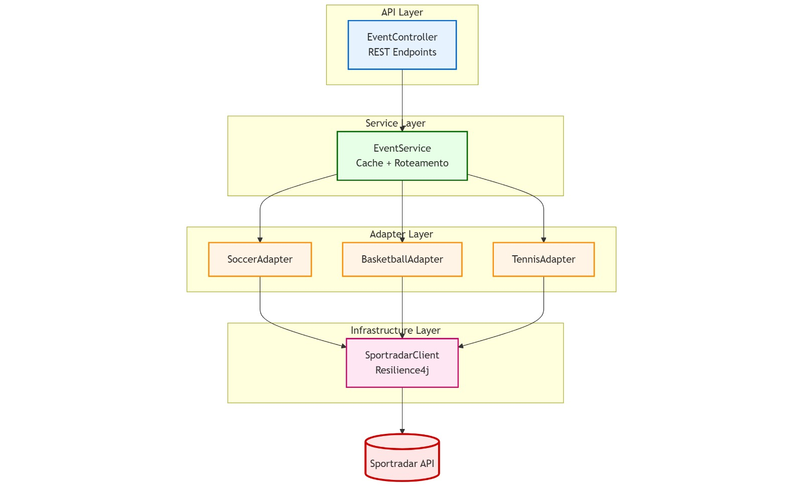

# SportsLiveService

Microserviço para consumo da Sportradar API com exposição de API unificada para dados esportivos.

## Equipe

- Luis Fernando Batista Lima – 538134
- Vitor Loula Silva – 540622

**Universidade Federal do Ceará — Campus Quixadá**  
**QXD0068 – Reuso de Software**  
**Prof. Francisco Victor da Silva Pinheiro**

## Relatório

📄 [Relatório Técnico](https://docs.google.com/document/d/1MaH1LlesCWj7JPZQ938mbe3C8O2YECyPSVj8vcodV-8/edit?tab=t.6o37xaw5w8cw)  
📎 PDF disponível no repositório

## Esportes Suportados

- ⚽ Soccer
- 🏀 Basketball
- 🎾 Tennis

## Executar

```bash
# Definir API Key
export SPORTRADAR_API_KEY=your-api-key

# Executar
mvn spring-boot:run
```

## Swagger Local

Acesse: http://localhost:8080/swagger-ui.html

## Sistema em Produção

🔗 [Acessar Swagger UI](https://gleaming-worm-vitor-project-201f7f66.koyeb.app/swagger-ui/index.html)

## Endpoints

| Método | Endpoint                                                        | Descrição             |
| ------ | --------------------------------------------------------------- | --------------------- |
| GET    | `/v1/{sport}/events/{eventId}`                                  | Detalhes do evento    |
| GET    | `/v1/{sport}/events/{eventId}/score`                            | Placar atual          |
| GET    | `/v1/{sport}/events/{eventId}/timeline`                         | Timeline/play-by-play |
| GET    | `/v1/{sport}/events/{eventId}/stats?advanced=true&period=total` | Estatísticas          |


## Arquitetura

- API Layer (Controllers)
- Service Layer (EventService) - Roteamento + Cache
- Adapter Layer (SoccerAdapter, BasketballAdapter, TennisAdapter)
- Infrastructure (SportradarClient) - Resilience4j (Circuit Breaker + Retry)



## Resiliência

- Circuit Breaker: 50% failure rate threshold
- Retry: 3 tentativas com backoff exponencial
- Timeout: 10 segundos
